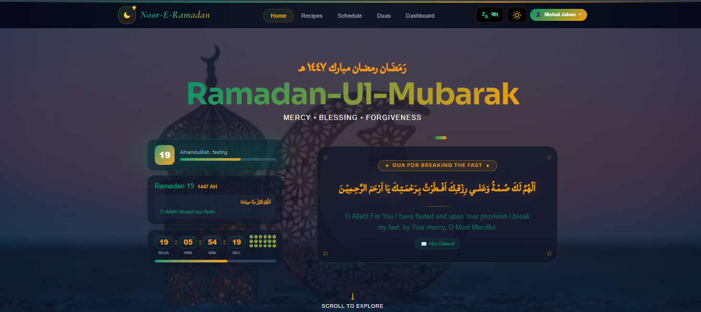

# 🌙 Noor-e-Ramadan — নূরে রমজান

<div align="center">



**A full-stack Ramadan companion app built with Next.js 15**

[](https://nextjs.org/)
[](https://www.mongodb.com/)
[](https://tailwindcss.com/)
[](https://www.framer.com/motion/)

[🌐 Live Demo](https://noor-e-ramadan-vert.vercel.app/) · [🐛 Report Bug](https://github.com/nishatjahan62/noor-e-ramadan/issues) · [✨ Request Feature](https://github.com/nishatjahan62/noor-e-ramadan/issues)

</div>

---

## ✨ Features

### 🕌 Ramadan Essentials
- **Sehri & Iftar Timings** — All 64 districts of Bangladesh
- **Full Ramadan Schedule** — Complete 30-day timetable
- **Salah Timings** — Fajr, Dhuhr, Asr, Maghrib, Isha

### 🤲 Duas Collection
- **17+ Duas** — Special duas for Ramadan
- Arabic text with Bengali & English translation and references
- Copy to clipboard, Expand/Collapse for long duas

### 🍽️ Recipes
- **28 Recipes** — Iftar, Sehri, Drinks and both categories
- Prep time, description and step-by-step instructions

### 👤 User Features (Auth Required)
- **Dashboard** — Daily Goals checklist with progress tracker
- **Bookmarks** — Save duas and recipes for later
- **Profile** — View your stats (Goals, Bookmarks)

### 🌐 Bilingual Support
- Full **Bengali & English** language support
- One-click language toggle

### 🎨 UI/UX
- **Dark & Light mode** with smooth transitions
- Animated Navbar with compact scroll mode
- Fully **responsive** — mobile, tablet, desktop
- Framer Motion animations throughout

---

## 🛠️ Tech Stack

| Category | Technology |
|---|---|
| Framework | Next.js 15 (App Router) |
| Styling | Tailwind CSS v4 |
| Animation | Framer Motion |
| Database | MongoDB Atlas |
| Auth | NextAuth.js v4 |
| Password Hashing | bcryptjs |
| Alerts | SweetAlert2 |
| Icons | React Icons |
| Deployment | Vercel |

---

## 🚀 Getting Started

### Prerequisites
- Node.js 18+
- MongoDB Atlas account
- npm or yarn

### Installation

**1. Clone the repository**
```bash
git clone https://github.com/nishatjahan62/noor-e-ramadan.git
cd noor-e-ramadan
```

**2. Install dependencies**
```bash
npm install
```

**3. Set up environment variables**

Create a `.env.local` file:
```env
MONGODB_URI=mongodb+srv://<username>:<password>@cluster0.xxxxx.mongodb.net/noor-e-ramadan?retryWrites=true&w=majority
NEXTAUTH_URL=http://localhost:3000
NEXTAUTH_SECRET=your-secret-key-here
```

**4. Run the development server**
```bash
npm run dev
```

Open [http://localhost:3000](http://localhost:3000) in your browser.

---

## 🌍 Deployment (Vercel)

**1.** Deploy the project on Vercel

**2.** Go to Settings → Environment Variables and add:

| Variable | Value |
|---|---|
| `MONGODB_URI` | Your MongoDB Atlas URI |
| `NEXTAUTH_URL` | `https://noor-e-ramadan-vert.vercel.app/` |
| `NEXTAUTH_SECRET` | Your secret key |

**3.** Redeploy — done!

---

## 🙏 Credits

- **Design & Development** — [Your Name](https://github.com/yourusername)
- **Special Thanks** — Nishat Jahan ❤️
- Ramadan timings data — [Aladhan API](https://aladhan.com/)
- Arabic fonts — Google Fonts (Amiri)

---

<div align="center">

**রমজান মোবারক 🌙**

Made with ❤️ for the Muslim community of Bangladesh

</div>